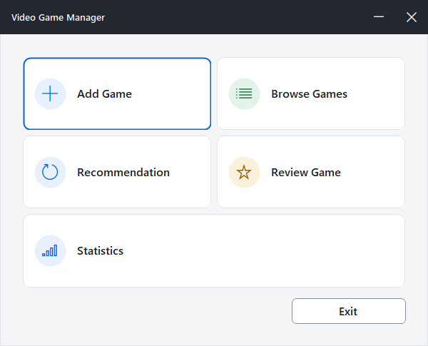
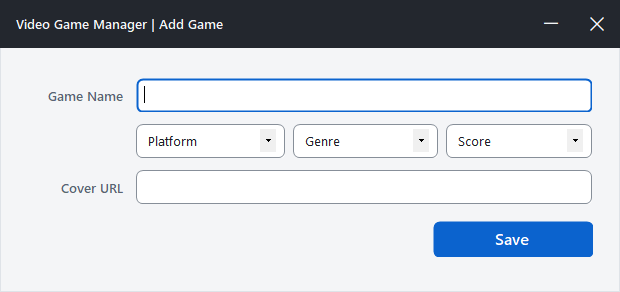
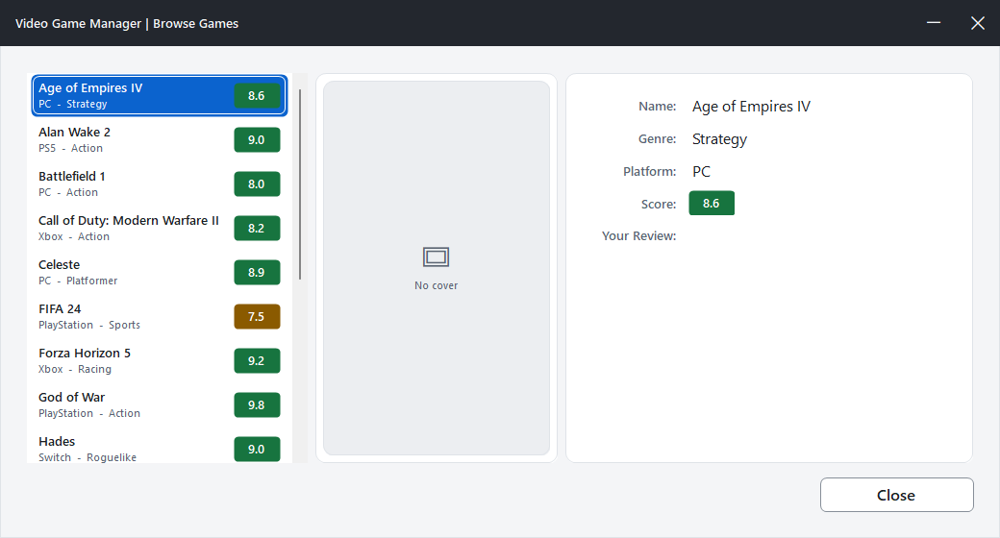
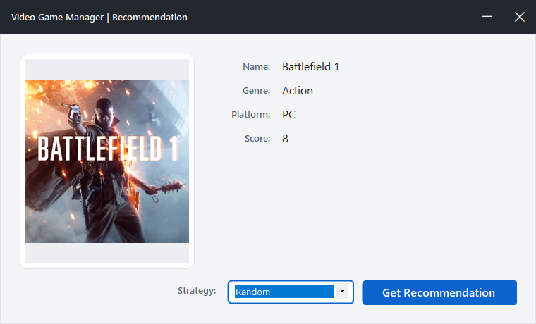
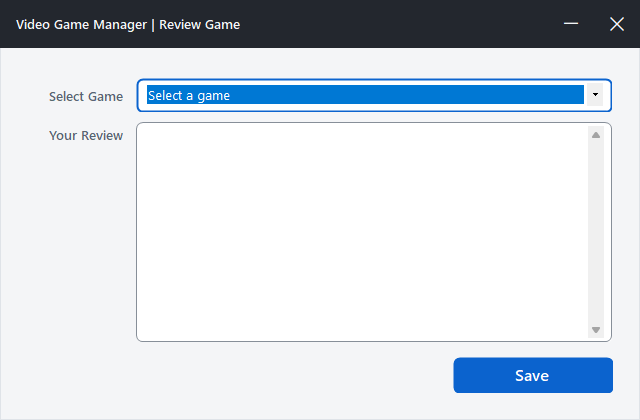
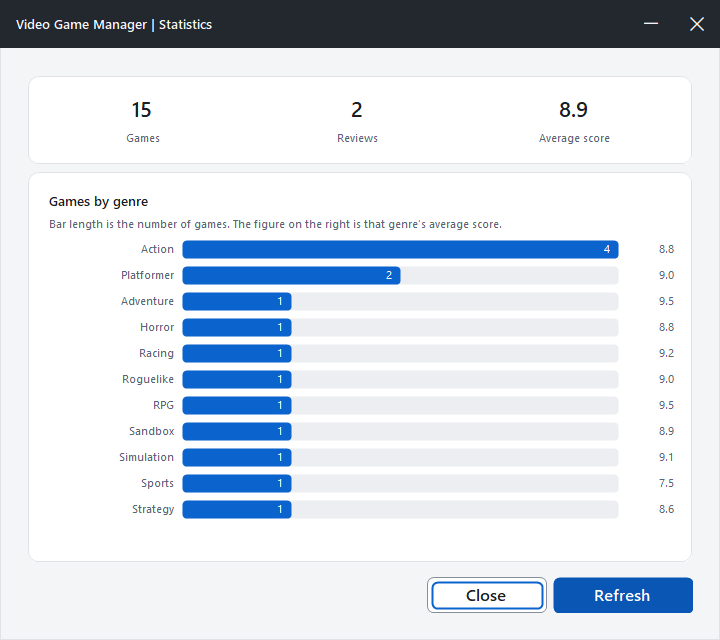
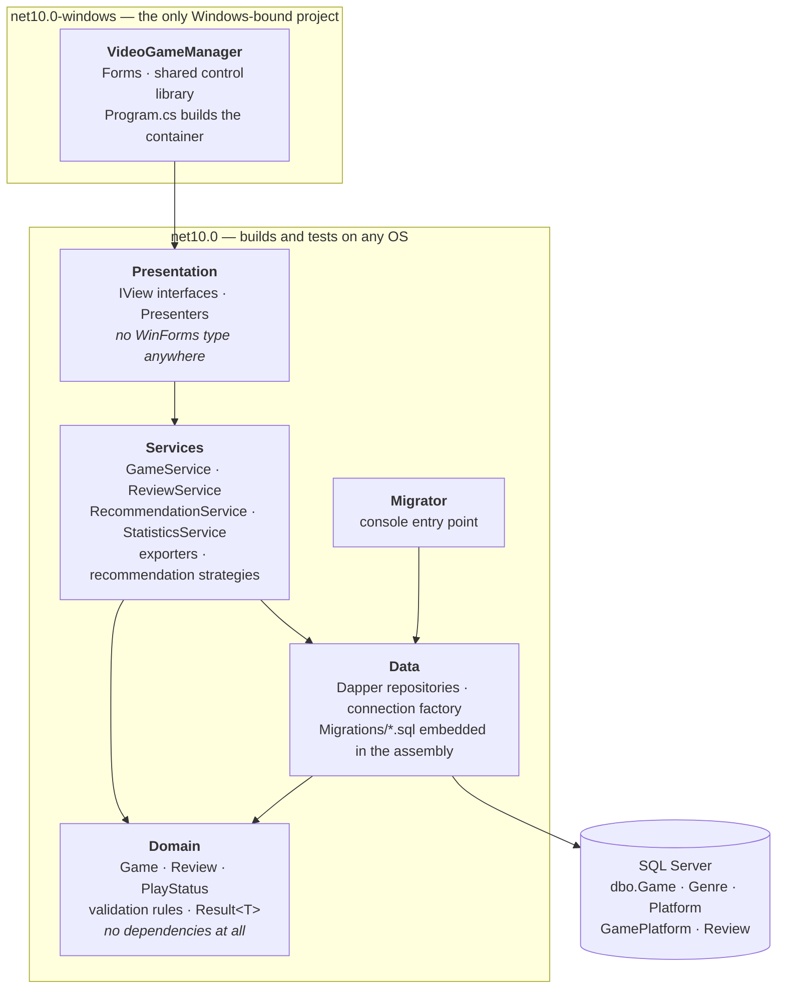
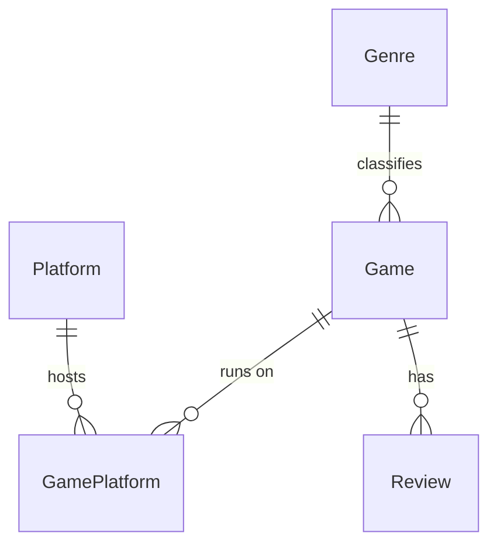

<div align="center">

# 🎮 Video Game Manager

**A Windows desktop app for cataloguing, rating and discovering video games.**

[](https://github.com/ayberkaarda/VideoOyunYonetim/actions/workflows/ci.yml)
[](#)
[](#)
[](#)
[](LICENSE)

**English** · [Türkçe](README.tr.md)



</div>

---

## Overview

Video Game Manager is a Windows Forms application backed by SQL Server. You add games to a
personal catalogue with a genre, a platform, a score and a cover image, search and filter
your way through it, leave a written review on any game, and get a suggestion when you
cannot decide what to play — either at random or weighted towards what you already rate
highly. A statistics screen shows how the catalogue breaks down by genre, and the whole
list exports to CSV or JSON.

## Features

| | |
|---|---|
| ➕ **Add a game** | Name, genre, platform, score (0–10), play status, favourite flag and a cover image URL |
| ✏️ **Edit & delete** | Change or remove any row in the catalogue, addressed by id |
| 📃 **Browse & inspect** | Pick a game from the list and see every field plus its cover art |
| 🔎 **Search & filter** | Live search by name with filters for genre, platform, score range, play status and favourites |
| 📄 **Paging & sorting** | Server-side `OFFSET/FETCH`, sorted by name or score |
| 🗣️ **Review** | Attach a written review to any game; the newest one shows on the detail screen |
| 🎲 **Recommend** | Three interchangeable strategies: random, weighted towards the genres you score highly, or backlog-first |
| 🖼️ **Cover cache** | Cover art is downloaded asynchronously and cached on disk; a placeholder stands in when a link is dead |
| 📊 **Statistics** | Distribution by genre and average scores, drawn on a hand-rolled bar chart |
| 📤 **Export** | Write the catalogue out as CSV or JSON |
| 🪟 **Custom chrome** | Borderless forms with hand-rolled minimise/close buttons |

## Screens

<table>
<tr>
<td width="50%">

**Add a game** — `AddGameForm`



</td>
<td width="50%">

**Browse games** — `BrowseGamesForm`



</td>
</tr>
<tr>
<td width="50%">

**Recommendation** — `RecommendationForm`



</td>
<td width="50%">

**Review a game** — `ReviewGameForm`



</td>
</tr>
<tr>
<td width="50%">

**Statistics** — `StatisticsForm`



</td>
<td width="50%">
</td>
</tr>
</table>

## Tech stack

- **C# / Windows Forms** on **.NET 10** (SDK-style project), layered into Domain / Data /
  Services / WinForms with the screens on the Model-View-Presenter pattern
- **SQL Server** for storage — the repository ships a Docker Compose file
- **[Dapper](https://github.com/DapperLib/Dapper)** over
  [`Microsoft.Data.SqlClient`](https://github.com/dotnet/SqlClient), every statement a
  constant with bound parameters
- **[DbUp](https://dbup.readthedocs.io/)** for schema migrations, applied at startup
- **[Serilog](https://serilog.net/)** behind `Microsoft.Extensions.Logging`, rolling file sink
- **[xUnit](https://xunit.net/)** with [FluentAssertions](https://fluentassertions.com/) and
  [NSubstitute](https://nsubstitute.github.io/) for unit tests, and
  [Testcontainers](https://dotnet.testcontainers.org/) for integration tests that raise a
  real SQL Server rather than a fake one
- **GitHub Actions** for build, test and format checks on every push and pull request

## Getting started

### Prerequisites

- Windows 10/11
- [.NET 10 SDK](https://dotnet.microsoft.com/download/dotnet/10.0) — `winget install Microsoft.DotNet.SDK.10`
- Docker Desktop (recommended) **or** any SQL Server instance you already have
- `sqlcmd` — `winget install Microsoft.Sqlcmd`

Visual Studio is optional; the solution builds and runs entirely from the CLI.

### 1. Start SQL Server

```powershell
# pick a password and put it in db/.env (git-ignored)
Copy-Item db/.env.example db/.env    # then edit the password

docker compose -f db/docker-compose.yml up -d
docker compose -f db/docker-compose.yml ps    # wait for "healthy"
```

Already running SQL Server (Express, Developer, LocalDB)? Skip this step and use your own
server name in the commands below.

### 2. Create the database

The tables are created by migration scripts, not by hand. `db/schema.sql` only creates the
empty database; `VideoGameManager.Migrator` brings the schema up to date. Every step here
is idempotent, so re-running any of them is safe.

```powershell
$sa = (Get-Content db/.env | Select-String 'MSSQL_SA_PASSWORD=(.*)').Matches.Groups[1].Value
$cs = "Server=localhost,1433;Database=VideoGameManager;User Id=sa;Password=$sa;TrustServerCertificate=True"

# 1. the database itself, with the collation the application expects
sqlcmd -S localhost,1433 -U sa -P $sa -C -i db/schema.sql

# 2. the schema — applies every migration the database has not seen yet
dotnet run --project VideoGameManager.Migrator -- $cs

# 3. sample data — 15 games, only inserts rows that are missing
#    -f 65001 is required: the file is UTF-8 and sqlcmd does not assume it
sqlcmd -S localhost,1433 -U sa -P $sa -C -f 65001 -d VideoGameManager -i db/seed.sql

# verify
sqlcmd -S localhost,1433 -U sa -P $sa -C -d VideoGameManager -Q "SELECT COUNT(*) FROM dbo.Game"   # 15
```

Step 2 is optional in practice — the application applies pending migrations itself when it
starts, as soon as the database answers. The migrator exists so that a database can be
prepared without launching the desktop application, and so that a build agent can stand one
up from nothing: given a connection string naming a database that does not exist yet, it
creates it with the right collation first.

> **Migrations are the only way the schema changes.** There is no `ALTER TABLE` by hand and
> no backup to restore. A correction is a new script in
> `VideoGameManager.Data/Migrations/`, never an edit to one that has already run — DbUp
> identifies a script by its name and will not notice that the contents changed.

### 3. Point the app at your server

The connection string lives in configuration, not in the code. `appsettings.json` is
committed with a placeholder; put the real one in `appsettings.Development.json`, which is
git-ignored:

```jsonc
// VideoGameManager/appsettings.Development.json
{
  "ConnectionStrings": {
    "VideoGameManager": "Server=localhost,1433;Database=VideoGameManager;User Id=sa;Password=YOUR_PASSWORD;TrustServerCertificate=True"
  }
}
```

`TrustServerCertificate=True` is not optional against a local server: `Microsoft.Data.SqlClient`
encrypts by default, and a container presents a certificate it signed itself, so the
connection fails during the handshake without it.

Environment variables work too, prefixed `VIDEOGAMEMANAGER_` — for example
`VIDEOGAMEMANAGER_ConnectionStrings__VideoGameManager`.

### 4. Build and run

```powershell
# from the repository root
dotnet build VideoGameManager.sln
dotnet run --project VideoGameManager
```

Or open `VideoGameManager.sln` in Visual Studio and press <kbd>F5</kbd>.

To review the shared control library on its own - every control in every state, no database
needed:

```powershell
dotnet run --project VideoGameManager -- --gallery
```

## Architecture

Six projects, and the arrow only ever points down. A layer knows the one below it and
nothing above it, so the database can be swapped without touching a screen and the screens
can be reworked without touching a query.



A few consequences worth naming:

- **Domain has no package references.** Entities and validation rules stay usable without a
  database or a window, which is what makes them cheap to test.
- **Only the desktop project targets Windows.** Everything below it is plain `net10.0`, so
  the test suite runs on a Linux build agent.
- **Screens follow Model-View-Presenter, in a project of their own.** A form implements an
  `IView` interface and owns no logic; the presenter holds the logic and mentions no WinForms
  type at all. That is why `VideoGameManager.Presentation` can target plain `net10.0` — and
  why the screen logic is unit-tested like any other layer instead of only being clicked
  through by hand ([ADR 0008](docs/adr/0008-presenters-in-their-own-project.md)).
- **The migrator is separate from the application.** A schema upgrade needs neither a desktop
  session nor the application's configuration files.

## Repository layout

```
.
├── .github/workflows/ci.yml     # build, test and format checks
├── .editorconfig                # coding style, read by `dotnet format`
├── db/
│   ├── docker-compose.yml       # local SQL Server 2022 container
│   ├── .env.example             # template for the SA password
│   ├── schema.sql               # creates the empty database (idempotent)
│   └── seed.sql                 # 15 sample games (idempotent)
├── docs/
│   ├── architecture.md          # layer contract: interfaces, rules, schema
│   └── adr/                     # architecture decision records
├── screenshots/                 # images used by this README
├── VideoGameManager.Domain/     # entities and validation, no dependencies
├── VideoGameManager.Data/       # Dapper repositories, connection factory
│   └── Migrations/              # DbUp scripts, embedded in the assembly
├── VideoGameManager.Services/   # business rules, recommendation strategies
├── VideoGameManager.Presentation/  # screen logic, no WinForms types
│   ├── Views/                   # view interfaces a form implements
│   └── Presenters/              # what each screen actually does
├── VideoGameManager.Migrator/   # console entry point for applying migrations
├── VideoGameManager/            # WinForms host
│   ├── Program.cs               # entry point, DI container, startup checks
│   ├── UI/                      # shared control library and theme
│   ├── MainForm.cs              # main menu
│   ├── AddGameForm.cs           # add a game
│   ├── BrowseGamesForm.cs       # browse, search, filter, page
│   ├── RecommendationForm.cs    # recommendation, one of three strategies
│   ├── ReviewGameForm.cs        # write a review
│   └── StatisticsForm.cs        # genre distribution and average scores
├── VideoGameManager.Tests/      # xUnit — unit tests and Testcontainers integration tests
├── VideoGameManager.Tests.Desktop/  # the few tests that need Windows (System.Drawing)
└── VideoGameManager.sln
```

[`docs/architecture.md`](docs/architecture.md) is the contract the layers were built
against: every interface signature was fixed there before implementation started.
[`docs/adr/`](docs/adr) records the decisions that were not obvious at the time — why Dapper
rather than EF Core, why .NET 10, why MVP, why DbUp.

### Database schema

Collated `Latin1_General_100_CI_AI` so that `LIKE '%fifa%'` matches `FIFA 24` and `pokemon`
matches `Pokémon`. The collation is not a detail: under a Turkish collation `I` and `i` are
different letters, so that first search returns nothing at all — with no error.



| Table | Columns | Notes |
|---|---|---|
| `dbo.Game` | `Id`, `Name`, `GenreId`, `Score`, `CoverUrl` | `Score` is `FLOAT NULL`, `CHECK` 0–10 |
| `dbo.Genre` | `Id`, `Name` | `Name` unique — Action, RPG, Strategy, … |
| `dbo.Platform` | `Id`, `Name` | `Name` unique — PC / PlayStation / PS5 / Xbox / Switch |
| `dbo.GamePlatform` | `GameId`, `PlatformId` | Composite key; cascades when a game is deleted |
| `dbo.Review` | `Id`, `GameId`, `Score`, `Body`, `CreatedAt` | `CHECK` 0–10; cascades with the game |
| `dbo.SchemaVersions` | — | Migration journal, maintained by DbUp |

A game carries a set of platforms rather than one, so the schema can hold a title that
ships on more than one. The add screen offers a single platform today, which is why every
seeded row has exactly one.

Reviews live in their own table with a timestamp. The detail screen shows the newest one.

## Roadmap

This project is being lifted from a student-grade prototype to a maintainable application
in numbered phases:

| Phase | Scope | Status |
|---|---|---|
| 0 | Repository hygiene — `.gitignore`, SQL scripts instead of a `.bak`, SDK-style .NET 10 project, English-only codebase | ✅ done |
| 1 | Layered architecture — Domain / Data / Services / WinForms, MVP, dependency injection | ✅ done |
| 2 | Configuration & error handling — `appsettings.json`, Serilog, validation, `async/await` | ✅ done |
| 3 | Database — normalisation, indexes, migrations | ✅ done |
| 4 | Tests — xUnit, FluentAssertions, NSubstitute, Testcontainers | ✅ done |
| 5 | Features — search, paging, smarter recommendations, image cache, export, statistics | ✅ done |
| 6 | CI & documentation — GitHub Actions, `.editorconfig`, `CHANGELOG.md` | ✅ done |

Known limitations are listed in [`CHANGELOG.md`](CHANGELOG.md) rather than hidden. The
application is DPI-unaware by design, matching the layout the forms were drawn against, and
three of the fifteen sample cover links have gone dead upstream — the app shows a
placeholder and logs the failure rather than pretending otherwise.

## Development

Everything below runs from the repository root and needs nothing but the .NET SDK — plus
Docker for the parts that talk to a database.

```powershell
# build the whole solution the way CI does
dotnet build VideoGameManager.sln --no-incremental -warnaserror

# unit tests only — no database, no Docker, about a second
dotnet test VideoGameManager.Tests --filter "FullyQualifiedName!~Integration"

# everything, including integration tests that start their own SQL Server container
dotnet test VideoGameManager.sln

# coding style: check, then fix
dotnet format VideoGameManager.sln --verify-no-changes
dotnet format VideoGameManager.sln
```

**The suite lives in two projects.** Almost everything is in `VideoGameManager.Tests`,
which targets `net10.0` and runs anywhere. `VideoGameManager.Tests.Desktop` targets
`net10.0-windows` and holds only what cannot be reached from a portable project — today
that is the cover art pipeline, which is `System.Drawing`. When you add a test, ask whether
it could run on Linux: if it could, it belongs in the first project
([ADR 0009](docs/adr/0009-a-second-test-project-for-windows-only-code.md)).

**Integration tests raise their own container.** They never connect to the development
database, so running them cannot damage your catalogue. They also do not skip themselves
when Docker is missing — they fail — because a suite that reports green without having
tested anything is worse than one that reports red.

**Changing the schema means writing a migration.** Add a numbered script to
`VideoGameManager.Data/Migrations/`; it is embedded in the assembly and picked up in name
order. Scripts must be re-runnable, and the application applies whatever is pending at
startup. To bring a database up to date without opening the application:

```powershell
dotnet run --project VideoGameManager.Migrator -- "Server=localhost,1433;Database=VideoGameManager;User Id=sa;Password=<password>;TrustServerCertificate=True"
```

**Rules the code is expected to keep**, all of which have a test or a build check behind
them:

| Rule | Why |
|---|---|
| SQL is a `const string` with bound parameters, never string concatenation | SQL injection |
| Rows are addressed by `Id`, never by `Name` | Two games can share a name; the wrong row would be updated silently, with no error |
| `[Platform]` is always bracketed | It is a reserved-ish identifier in T-SQL |
| No database access or business logic in a form's code-behind | The presenter is the only place screen logic lives |
| Validation rules live in Domain, and only there | One rule, one home; the UI only renders the result |
| No empty `catch`, and no `MessageBox.Show(ex.Message)` | Errors are logged in English with detail, and shown to the user as something they can act on |
| Database and network calls are `async` | The UI thread is never blocked |
| The schema changes only through a migration | A clean database must be rebuildable from zero |

## Contributing

Issues and pull requests are welcome.

Before opening a pull request:

1. `dotnet build VideoGameManager.sln --no-incremental -warnaserror` — CI treats warnings as
   errors, and an incremental build silently skips the analyzers.
2. `dotnet test VideoGameManager.sln` — including the integration tests.
3. `dotnet format VideoGameManager.sln --verify-no-changes` — the style rules live in
   `.editorconfig`.

Please also:

- Keep one logical change per commit, and write the subject as
  `type(scope): subject` — for example `feat(services): weight recommendations by genre`.
  Scopes match the project directories: `domain`, `data`, `services`, `presentation`,
  `winforms`, `tests`, `db`, `docs`, `ci`.
- Write code, comments, identifiers and commit messages in English.
- Add new user-facing strings to `Properties/Resources.resx` rather than hard-coding them.
- Never commit a connection string or a password. `appsettings.json` carries a placeholder;
  the real value belongs in `appsettings.Development.json`, which is git-ignored.
- Record a decision that a reader would otherwise have to reverse-engineer as an ADR in
  `docs/adr/`.

## Author

**Ayberk Arda** — [@ayberkaarda](https://github.com/ayberkaarda)

## License

Released under the [MIT License](LICENSE).
