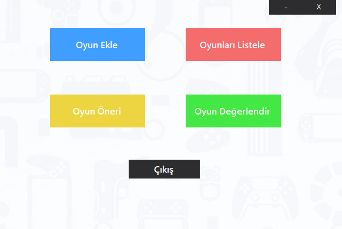
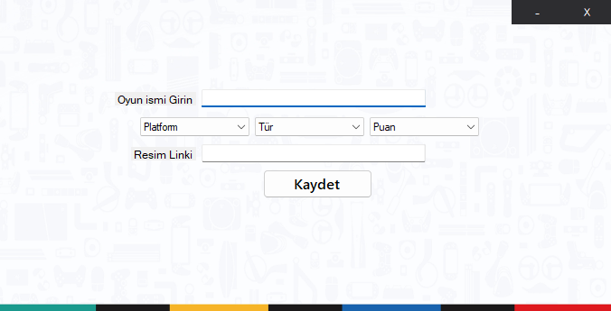
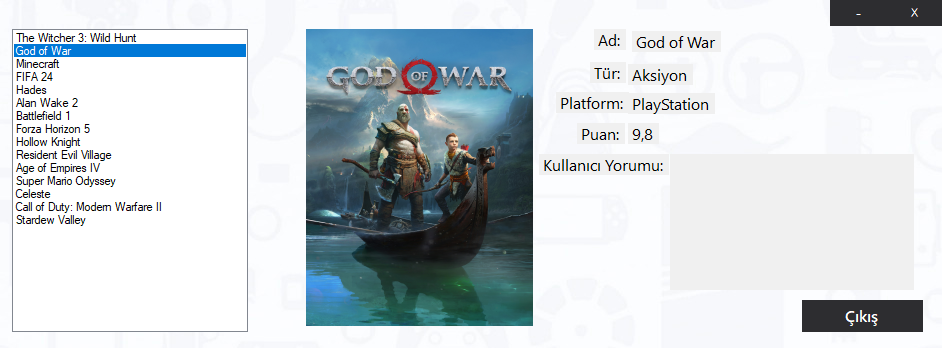
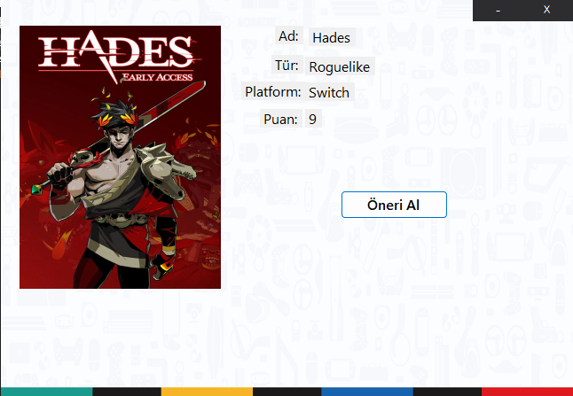
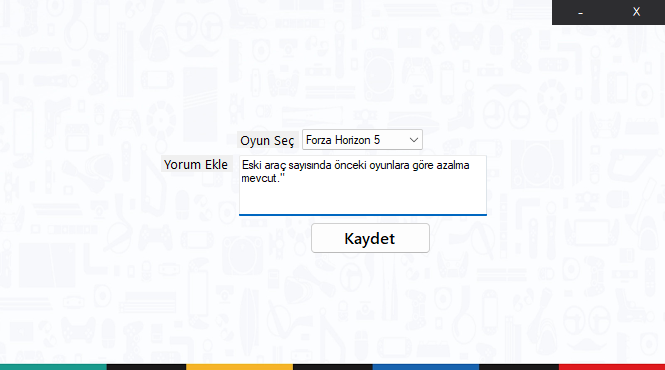

<div align="center">

# 🎮 VideoOyunYonetim

**A Windows desktop app for cataloguing, rating and discovering video games.**

[](#)
[](#)
[](#)
[](LICENSE)

**English** · [Türkçe](README.tr.md)



</div>

---

## Overview

VideoOyunYonetim is a Windows Forms application backed by SQL Server. You add games to a
personal catalogue with a genre, a platform, a score and a cover image, browse the
catalogue with full details, leave a written review on any game, and get a random pick
when you cannot decide what to play.

> **Note** — The user interface is in Turkish. This README is the English entry point;
> the Turkish one lives in [README.tr.md](README.tr.md).

## Features

| | |
|---|---|
| ➕ **Add a game** | Name, genre, platform, score (1–10) and a cover image URL |
| 📃 **Browse & inspect** | Pick a game from the list and see every field plus its cover art |
| 🗣️ **Review** | Attach a written review to any game in the catalogue |
| 🎲 **Recommend** | Draw a random game from the catalogue with its cover |
| 🪟 **Custom chrome** | Borderless forms with hand-rolled minimise/close buttons |

## Screens

<table>
<tr>
<td width="50%">

**Add a game** — `OyunEkleForm`



</td>
<td width="50%">

**Browse games** — `OyunListeleForm`



</td>
</tr>
<tr>
<td width="50%">

**Recommendation** — `OyunOneriForm`



</td>
<td width="50%">

**Review a game** — `OyunDegerlendirForm`



</td>
</tr>
</table>

## Tech stack

- **C# / Windows Forms** on **.NET 10** (SDK-style project)
- **SQL Server** for storage — the repository ships a Docker Compose file
- **ADO.NET** via [`Microsoft.Data.SqlClient`](https://github.com/dotnet/SqlClient) with parameterised commands

## Getting started

### Prerequisites

- Windows 10/11
- [.NET 10 SDK](https://dotnet.microsoft.com/download/dotnet/10.0) — `winget install Microsoft.DotNet.SDK.10`
- Docker Desktop (recommended) **or** any SQL Server instance you already have
- `sqlcmd` — `winget install Microsoft.Sqlcmd`

Visual Studio is optional; the solution builds and runs entirely from the CLI.

### 1. Start SQL Server

```powershell
# pick a password and put it in db/.env (git-ignored)
Copy-Item db/.env.example db/.env    # then edit the password

docker compose -f db/docker-compose.yml up -d
docker compose -f db/docker-compose.yml ps    # wait for "healthy"
```

Already running SQL Server (Express, Developer, LocalDB)? Skip this step and use your own
server name in the commands below.

### 2. Create the database

The database is created from version-controlled SQL scripts. Both are idempotent, so
re-running them is safe.

```powershell
$sa = (Get-Content db/.env | Select-String 'MSSQL_SA_PASSWORD=(.*)').Matches.Groups[1].Value

# schema — creates the VideoOyun database and the Oyunlar table
sqlcmd -S localhost,1433 -U sa -P $sa -C -i db/schema.sql

# sample data — 15 games, only inserts rows that are missing
sqlcmd -S localhost,1433 -U sa -P $sa -C -d VideoOyun -i db/seed.sql -f 65001

# verify
sqlcmd -S localhost,1433 -U sa -P $sa -C -d VideoOyun -Q "SELECT COUNT(*) FROM dbo.Oyunlar"   # 15
```

The `-f 65001` flag tells `sqlcmd` that `seed.sql` is UTF-8, which keeps Turkish characters
intact. Prefer a GUI? Open both files in SQL Server Management Studio or Azure Data Studio
and execute them in that order.

### 3. Point the app at your server

Open [`VideoOyunY/DatabaseHelper.cs`](VideoOyunY/DatabaseHelper.cs) and set the connection
string:

```csharp
private static string connectionString =
    "Server=localhost,1433;Database=VideoOyun;User Id=sa;Password=YOUR_PASSWORD;TrustServerCertificate=True;";
```

> The connection string is currently hard-coded. Moving it to `appsettings.json` is
> tracked as Phase 2 of the [roadmap](#roadmap).

### 4. Build and run

```powershell
# from the repository root
dotnet build VideoOyunY.sln
dotnet run --project VideoOyunY
```

Or open `VideoOyunY.sln` in Visual Studio and press <kbd>F5</kbd>.

## Repository layout

```
VideoOyunYonetim/
├── db/
│   ├── docker-compose.yml    # local SQL Server 2022 container
│   ├── .env.example          # template for the SA password
│   ├── schema.sql            # database + table definition (idempotent)
│   └── seed.sql              # 15 sample games (idempotent)
├── screenshots/              # images used by the READMEs
├── VideoOyunY/
│   ├── Program.cs            # entry point
│   ├── Form1.cs              # main menu
│   ├── OyunEkleForm.cs       # add a game
│   ├── OyunListeleForm.cs    # browse the catalogue
│   ├── OyunOneriForm.cs      # random recommendation
│   ├── OyunDegerlendirForm.cs# write a review
│   ├── DatabaseHelper.cs     # ADO.NET helper
│   ├── Oyun.cs               # game model
│   └── Oyuncu.cs             # player model
└── VideoOyunY.sln
```

### Database schema

| Column | Type | Notes |
|---|---|---|
| `Id` | `INT IDENTITY` | Primary key |
| `Ad` | `NVARCHAR(100)` | Game name |
| `Tur` | `NVARCHAR(50)` | Genre |
| `Platform` | `NVARCHAR(50)` | PC / PlayStation / Xbox / Switch |
| `Puan` | `FLOAT` | Score, 1–10 |
| `ResimLink` | `NVARCHAR(MAX)` | Cover image URL |
| `Yorum` | `NVARCHAR(MAX)` | User review |

## Roadmap

This project is being lifted from a student-grade prototype to a maintainable application
in numbered phases:

| Phase | Scope | Status |
|---|---|---|
| 0 | Repository hygiene — `.gitignore`, SQL scripts instead of a `.bak`, SDK-style .NET 10 project | ✅ done |
| 1 | Layered architecture — Domain / Data / Services / WinForms, MVP, dependency injection | ⏳ planned |
| 2 | Configuration & error handling — `appsettings.json`, Serilog, validation, `async/await` | ⏳ planned |
| 3 | Database — normalisation, indexes, migrations | ⏳ planned |
| 4 | Tests — xUnit, FluentAssertions, NSubstitute | ⏳ planned |
| 5 | Features — search, paging, smarter recommendations, image cache, export, statistics | ⏳ planned |
| 6 | CI & documentation — GitHub Actions, `.editorconfig`, `CHANGELOG.md` | ⏳ planned |

## Contributing

Issues and pull requests are welcome. Please keep each phase in its own commit and make
sure the solution still builds before opening a PR.

## Author

**Ayberk Arda** — [@ayberkaarda](https://github.com/ayberkaarda)

## License

Released under the [MIT License](LICENSE).
