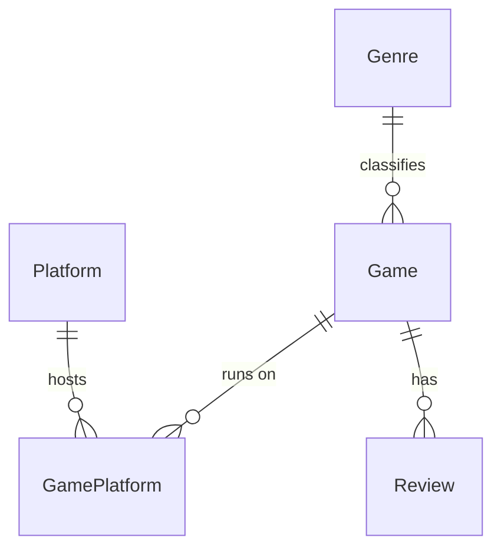

<div align="center">

# 🎮 Video Game Manager

**A Windows desktop app for cataloguing, rating and discovering video games.**

[](#)
[](#)
[](#)
[](LICENSE)


</div>

---

## Overview

Video Game Manager is a Windows Forms application backed by SQL Server. You add games to a
personal catalogue with a genre, a platform, a score and a cover image, browse the
catalogue with full details, leave a written review on any game, and get a random pick
when you cannot decide what to play.

## Features

| | |
|---|---|
| ➕ **Add a game** | Name, genre, platform, score (1–10) and a cover image URL |
| 📃 **Browse & inspect** | Pick a game from the list and see every field plus its cover art |
| 🗣️ **Review** | Attach a written review to any game in the catalogue |
| 🎲 **Recommend** | Draw a random game from the catalogue with its cover |
| 🪟 **Custom chrome** | Borderless forms with hand-rolled minimise/close buttons |

## Screens

<table>
<tr>
<td width="50%">

**Add a game** — `AddGameForm`


</td>
<td width="50%">

**Browse games** — `BrowseGamesForm`


</td>
</tr>
<tr>
<td width="50%">

**Recommendation** — `RecommendationForm`


</td>
<td width="50%">

**Review a game** — `ReviewGameForm`


</td>
</tr>
</table>

## Tech stack

- **C# / Windows Forms** on **.NET 10** (SDK-style project), layered into Domain / Data /
  Services / WinForms with the screens on the Model-View-Presenter pattern
- **SQL Server** for storage — the repository ships a Docker Compose file
- **[Dapper](https://github.com/DapperLib/Dapper)** over
  [`Microsoft.Data.SqlClient`](https://github.com/dotnet/SqlClient), every statement a
  constant with bound parameters
- **[DbUp](https://dbup.readthedocs.io/)** for schema migrations, applied at startup
- **[Serilog](https://serilog.net/)** behind `Microsoft.Extensions.Logging`, rolling file sink

## Getting started

### Prerequisites

- Windows 10/11
- [.NET 10 SDK](https://dotnet.microsoft.com/download/dotnet/10.0) — `winget install Microsoft.DotNet.SDK.10`
- Docker Desktop (recommended) **or** any SQL Server instance you already have
- `sqlcmd` — `winget install Microsoft.Sqlcmd`

Visual Studio is optional; the solution builds and runs entirely from the CLI.

### 1. Start SQL Server

```powershell
# pick a password and put it in db/.env (git-ignored)
Copy-Item db/.env.example db/.env    # then edit the password

docker compose -f db/docker-compose.yml up -d
docker compose -f db/docker-compose.yml ps    # wait for "healthy"
```

Already running SQL Server (Express, Developer, LocalDB)? Skip this step and use your own
server name in the commands below.

### 2. Create the database

The tables are created by migration scripts, not by hand. `db/schema.sql` only creates the
empty database; `VideoGameManager.Migrator` brings the schema up to date. Every step here
is idempotent, so re-running any of them is safe.

```powershell
$sa = (Get-Content db/.env | Select-String 'MSSQL_SA_PASSWORD=(.*)').Matches.Groups[1].Value
$cs = "Server=localhost,1433;Database=VideoGameManager;User Id=sa;Password=$sa;TrustServerCertificate=True"

# 1. the database itself, with the collation the application expects
sqlcmd -S localhost,1433 -U sa -P $sa -C -i db/schema.sql

# 2. the schema — applies every migration the database has not seen yet
dotnet run --project VideoGameManager.Migrator -- $cs

# 3. sample data — 15 games, only inserts rows that are missing
#    -f 65001 is required: the file is UTF-8 and sqlcmd does not assume it
sqlcmd -S localhost,1433 -U sa -P $sa -C -f 65001 -d VideoGameManager -i db/seed.sql

# verify
sqlcmd -S localhost,1433 -U sa -P $sa -C -d VideoGameManager -Q "SELECT COUNT(*) FROM dbo.Game"   # 15
```

Step 2 is optional in practice — the application applies pending migrations itself when it
starts, as soon as the database answers. The migrator exists so that a database can be
prepared without launching the desktop application, and so that a build agent can stand one
up from nothing: given a connection string naming a database that does not exist yet, it
creates it with the right collation first.

> **Migrations are the only way the schema changes.** There is no `ALTER TABLE` by hand and
> no backup to restore. A correction is a new script in
> `VideoGameManager.Data/Migrations/`, never an edit to one that has already run — DbUp
> identifies a script by its name and will not notice that the contents changed.

### 3. Point the app at your server

The connection string lives in configuration, not in the code. `appsettings.json` is
committed with a placeholder; put the real one in `appsettings.Development.json`, which is
git-ignored:

```jsonc
// VideoGameManager/appsettings.Development.json
{
  "ConnectionStrings": {
    "VideoGameManager": "Server=localhost,1433;Database=VideoGameManager;User Id=sa;Password=YOUR_PASSWORD;TrustServerCertificate=True"
  }
}
```

`TrustServerCertificate=True` is not optional against a local server: `Microsoft.Data.SqlClient`
encrypts by default, and a container presents a certificate it signed itself, so the
connection fails during the handshake without it.

Environment variables work too, prefixed `VIDEOGAMEMANAGER_` — for example
`VIDEOGAMEMANAGER_ConnectionStrings__VideoGameManager`.

### 4. Build and run

```powershell
# from the repository root
dotnet build VideoGameManager.sln
dotnet run --project VideoGameManager
```

Or open `VideoGameManager.sln` in Visual Studio and press <kbd>F5</kbd>.

To review the shared control library on its own - every control in every state, no database
needed:

```powershell
dotnet run --project VideoGameManager -- --gallery
```

## Repository layout

```
.
├── db/
│   ├── docker-compose.yml       # local SQL Server 2022 container
│   ├── .env.example             # template for the SA password
│   ├── schema.sql               # creates the empty database (idempotent)
│   └── seed.sql                 # 15 sample games (idempotent)
├── docs/
│   ├── architecture.md          # layer contract: interfaces, rules, schema
│   └── adr/                     # architecture decision records
├── screenshots/                 # images used by this README
├── VideoGameManager.Domain/     # entities and validation, no dependencies
├── VideoGameManager.Data/       # Dapper repositories, connection factory
│   └── Migrations/              # DbUp scripts, embedded in the assembly
├── VideoGameManager.Services/   # business rules, recommendation strategies
├── VideoGameManager.Migrator/   # console entry point for applying migrations
├── VideoGameManager/            # WinForms host
│   ├── Program.cs               # entry point, DI container, startup checks
│   ├── Views/                   # view interfaces, no WinForms types
│   ├── Presenters/              # screen logic, no WinForms types
│   ├── UI/                      # shared control library and theme
│   ├── MainForm.cs              # main menu
│   ├── AddGameForm.cs           # add a game
│   ├── BrowseGamesForm.cs       # browse the catalogue
│   ├── RecommendationForm.cs    # random recommendation
│   └── ReviewGameForm.cs        # write a review
└── VideoGameManager.sln
```

Dependencies run one way: WinForms → Services → Data → Domain. Domain has no dependencies
at all, and only the WinForms project targets Windows, so the layers below it build and
test on a Linux agent. [`docs/architecture.md`](docs/architecture.md) is the contract.

### Database schema

Collated `Latin1_General_100_CI_AI` so that `LIKE '%fifa%'` matches `FIFA 24` and `pokemon`
matches `Pokémon`. The collation is not a detail: under a Turkish collation `I` and `i` are
different letters, so that first search returns nothing at all — with no error.



| Table | Columns | Notes |
|---|---|---|
| `dbo.Game` | `Id`, `Name`, `GenreId`, `Score`, `CoverUrl` | `Score` is `FLOAT NULL`, `CHECK` 0–10 |
| `dbo.Genre` | `Id`, `Name` | `Name` unique — Action, RPG, Strategy, … |
| `dbo.Platform` | `Id`, `Name` | `Name` unique — PC / PlayStation / PS5 / Xbox / Switch |
| `dbo.GamePlatform` | `GameId`, `PlatformId` | Composite key; cascades when a game is deleted |
| `dbo.Review` | `Id`, `GameId`, `Score`, `Body`, `CreatedAt` | `CHECK` 0–10; cascades with the game |
| `dbo.SchemaVersions` | — | Migration journal, maintained by DbUp |

A game carries a set of platforms rather than one, so the schema can hold a title that
ships on more than one. The add screen offers a single platform today, which is why every
seeded row has exactly one.

Reviews live in their own table with a timestamp. The detail screen shows the newest one.

## Roadmap

This project is being lifted from a student-grade prototype to a maintainable application
in numbered phases:

| Phase | Scope | Status |
|---|---|---|
| 0 | Repository hygiene — `.gitignore`, SQL scripts instead of a `.bak`, SDK-style .NET 10 project, English-only codebase | ✅ done |
| 1 | Layered architecture — Domain / Data / Services / WinForms, MVP, dependency injection | ✅ done |
| 2 | Configuration & error handling — `appsettings.json`, Serilog, validation, `async/await` | ✅ done |
| 3 | Database — normalisation, indexes, migrations | ✅ done |
| 4 | Tests — xUnit, FluentAssertions, NSubstitute | ⏳ planned |
| 5 | Features — search, paging, smarter recommendations, image cache, export, statistics | ⏳ planned |
| 6 | CI & documentation — GitHub Actions, `.editorconfig`, `CHANGELOG.md` | ⏳ planned |

## Contributing

Issues and pull requests are welcome. Please keep each phase in its own commit and make
sure the solution still builds before opening a PR.

## Author

**Ayberk Arda** — [@ayberkaarda](https://github.com/ayberkaarda)

## License

Released under the [MIT License](LICENSE).
