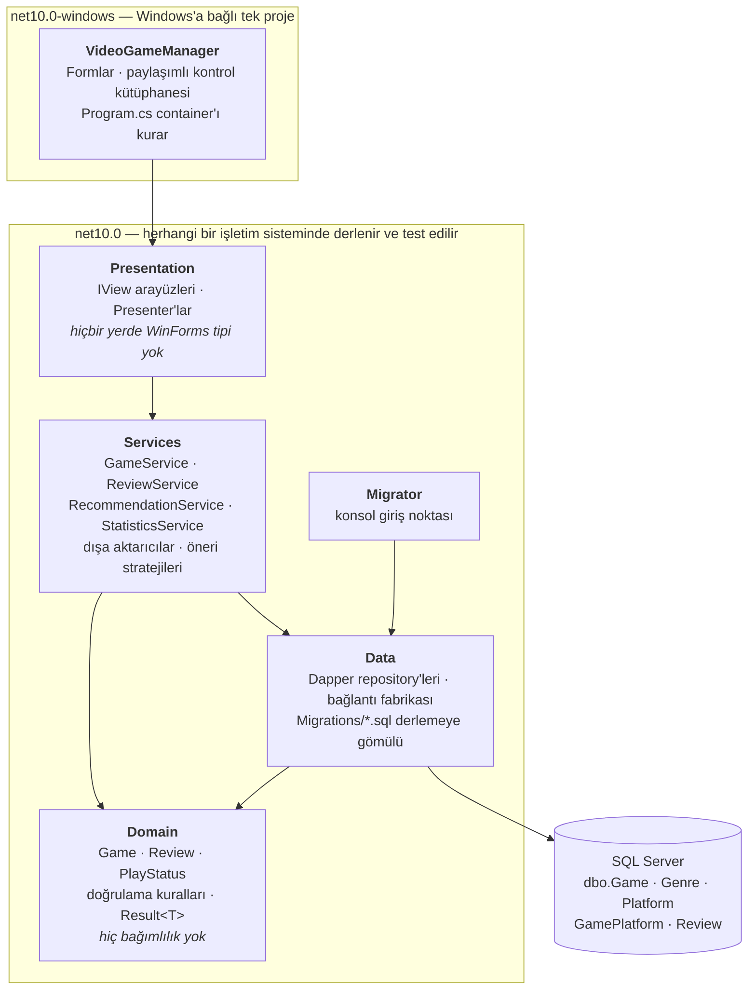
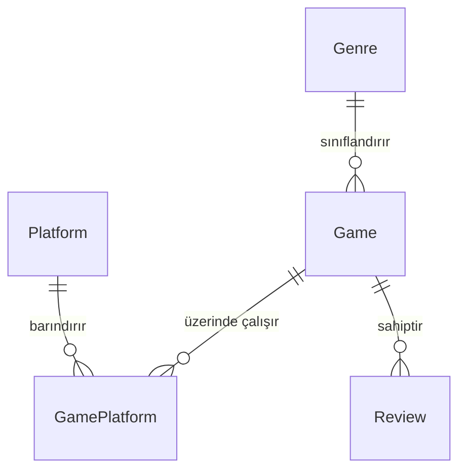

<div align="center">

# 🎮 Video Game Manager

**Video oyunu kataloglamak, puanlamak ve keşfetmek için bir Windows masaüstü uygulaması.**

[](https://github.com/ayberkaarda/VideoOyunYonetim/actions/workflows/ci.yml)
[](#)
[](#)
[](#)
[](LICENSE)

[English](README.md) · **Türkçe**


</div>

---

## Genel bakış

Video Game Manager, arkasında SQL Server olan bir Windows Forms uygulamasıdır. Kişisel
kataloğunuza tür, platform, puan ve kapak görseliyle oyunlar eklersiniz; kataloğu arayıp
filtreleyebilir, herhangi bir oyuna yazılı bir değerlendirme bırakabilir ve ne
oynayacağınıza karar veremediğinizde bir öneri alabilirsiniz — ister rastgele, ister
zaten yüksek puan verdiğiniz türlere ağırlıklı olarak. Bir istatistik ekranı kataloğun
türlere göre dağılımını gösterir ve tüm liste CSV veya JSON olarak dışa aktarılabilir.

## Özellikler

| | |
|---|---|
| ➕ **Oyun ekleme** | Ad, tür, platform, puan (0–10), oynama durumu, favori işareti ve bir kapak görseli URL'si |
| ✏️ **Düzenleme ve silme** | Katalogdaki herhangi bir satırı, id ile hedefleyerek değiştirme veya kaldırma |
| 📃 **Gezinme ve inceleme** | Listeden bir oyun seçip tüm alanlarını ve kapak görselini görme |
| 🔎 **Arama ve filtreleme** | Ada göre canlı arama; tür, platform, puan aralığı, oynama durumu ve favorilere göre filtreler |
| 📄 **Sayfalama ve sıralama** | Sunucu tarafında `OFFSET/FETCH`, ada veya puana göre sıralanmış |
| 🗣️ **Değerlendirme** | Herhangi bir oyuna yazılı bir değerlendirme ekleme; en yenisi detay ekranında görünür |
| 🎲 **Öneri** | Birbirinin yerine geçebilen üç strateji: rastgele, yüksek puan verdiğiniz türlere ağırlıklı veya önce oynanmamışları öne çıkaran |
| 🖼️ **Kapak önbelleği** | Kapak görselleri eşzamansız indirilip diskte önbelleğe alınır; bağlantı ölüyse yerine bir yer tutucu görsel gösterilir |
| 📊 **İstatistikler** | Türe göre dağılım ve ortalama puanlar, elle hazırlanmış bir çubuk grafikle çizilir |
| 📤 **Dışa aktarma** | Kataloğu CSV veya JSON olarak yazma |
| 🪟 **Özel pencere çerçevesi** | Kenarlıksız formlar, elle hazırlanmış küçültme/kapatma düğmeleriyle |

## Ekranlar

<table>
<tr>
<td width="50%">

**Oyun ekleme** — `AddGameForm`


</td>
<td width="50%">

**Oyunlara göz atma** — `BrowseGamesForm`


</td>
</tr>
<tr>
<td width="50%">

**Öneri** — `RecommendationForm`


</td>
<td width="50%">

**Oyunu değerlendirme** — `ReviewGameForm`


</td>
</tr>
<tr>
<td width="50%">

**İstatistikler** — `StatisticsForm`


</td>
<td width="50%">
</td>
</tr>
</table>

## Teknoloji yığını

- **C# / Windows Forms**, **.NET 10** üzerinde (SDK-style proje); Domain / Data /
  Services / WinForms katmanlarına ayrılmış, ekranlar Model-View-Presenter deseninde
- Depolama için **SQL Server** — depo bir Docker Compose dosyasıyla birlikte gelir
- [`Microsoft.Data.SqlClient`](https://github.com/dotnet/SqlClient) üzerinde
  **[Dapper](https://github.com/DapperLib/Dapper)**, her sorgu bağlı parametreli bir
  sabit (constant) olarak
- Başlangıçta uygulanan şema migration'ları için **[DbUp](https://dbup.readthedocs.io/)**
- `Microsoft.Extensions.Logging` arkasında **[Serilog](https://serilog.net/)**, dönen
  (rolling) bir dosya sink'i ile
- Birim testler için [FluentAssertions](https://fluentassertions.com/) ve
  [NSubstitute](https://nsubstitute.github.io/) ile **[xUnit](https://xunit.net/)**;
  sahte değil gerçek bir SQL Server ayağa kaldıran entegrasyon testleri için
  [Testcontainers](https://dotnet.testcontainers.org/)
- Her push ve pull request'te derleme, test ve biçim (format) kontrolleri için
  **GitHub Actions**

## Başlarken

### Önkoşullar

- Windows 10/11
- [.NET 10 SDK](https://dotnet.microsoft.com/download/dotnet/10.0) — `winget install Microsoft.DotNet.SDK.10`
- Docker Desktop (önerilir) **veya** zaten sahip olduğunuz herhangi bir SQL Server örneği
- `sqlcmd` — `winget install Microsoft.Sqlcmd`

Visual Studio isteğe bağlıdır; çözüm tamamen CLI'dan derlenip çalıştırılabilir.

### 1. SQL Server'ı başlatın

```powershell
# bir şifre seçin ve db/.env içine yazın (git tarafından yok sayılır)
Copy-Item db/.env.example db/.env    # ardından şifreyi düzenleyin

docker compose -f db/docker-compose.yml up -d
docker compose -f db/docker-compose.yml ps    # "healthy" durumunu bekleyin
```

Zaten çalışan bir SQL Server'ınız mı var (Express, Developer, LocalDB)? Bu adımı atlayıp
aşağıdaki komutlarda kendi sunucu adınızı kullanın.

### 2. Veritabanını oluşturun

Tablolar elle değil, migration script'leriyle oluşturulur. `db/schema.sql` yalnızca boş
veritabanını oluşturur; şemayı güncel hale getiren `VideoGameManager.Migrator`'dır.
Buradaki her adım idempotent'tir, yani herhangi birini tekrar çalıştırmak güvenlidir.

```powershell
$sa = (Get-Content db/.env | Select-String 'MSSQL_SA_PASSWORD=(.*)').Matches.Groups[1].Value
$cs = "Server=localhost,1433;Database=VideoGameManager;User Id=sa;Password=$sa;TrustServerCertificate=True"

# 1. uygulamanın beklediği collation ile veritabanının kendisi
sqlcmd -S localhost,1433 -U sa -P $sa -C -i db/schema.sql

# 2. şema — veritabanının henüz görmediği her migration'ı uygular
dotnet run --project VideoGameManager.Migrator -- $cs

# 3. örnek veri — 15 oyun, yalnızca eksik satırları ekler
#    -f 65001 zorunludur: dosya UTF-8'dir ve sqlcmd bunu varsaymaz
sqlcmd -S localhost,1433 -U sa -P $sa -C -f 65001 -d VideoGameManager -i db/seed.sql

# doğrulama
sqlcmd -S localhost,1433 -U sa -P $sa -C -d VideoGameManager -Q "SELECT COUNT(*) FROM dbo.Game"   # 15
```

2. adım pratikte isteğe bağlıdır — uygulama, veritabanı yanıt verir vermez başlangıçta
bekleyen migration'ları kendisi uygular. Migrator'ın var olma sebebi, masaüstü uygulaması
hiç açılmadan bir veritabanının hazırlanabilmesi ve bir build agent'ının sıfırdan bir
veritabanı ayağa kaldırabilmesidir: henüz var olmayan bir veritabanını adlandıran bir
bağlantı cümlesi verildiğinde, onu doğru collation ile önce kendisi oluşturur.

> **Şema yalnızca migration'larla değişir.** Elle `ALTER TABLE` yoktur, geri yüklenecek
> bir yedek de yoktur. Bir düzeltme, `VideoGameManager.Data/Migrations/` içinde yeni bir
> script demektir; zaten çalışmış bir script'in düzenlenmesi değil — DbUp bir script'i
> adından tanır ve içeriğinin değiştiğini fark etmez.

### 3. Uygulamayı sunucunuza yönlendirin

Bağlantı cümlesi kodda değil, yapılandırmada yaşar. `appsettings.json` bir yer tutucuyla
commit'lenmiştir; gerçek değeri git tarafından yok sayılan `appsettings.Development.json`
içine koyun:

```jsonc
// VideoGameManager/appsettings.Development.json
{
  "ConnectionStrings": {
    "VideoGameManager": "Server=localhost,1433;Database=VideoGameManager;User Id=sa;Password=YOUR_PASSWORD;TrustServerCertificate=True"
  }
}
```

Yerel bir sunucuya karşı `TrustServerCertificate=True` isteğe bağlı değildir:
`Microsoft.Data.SqlClient` varsayılan olarak şifreler ve bir konteyner kendi imzaladığı
bir sertifika sunar, bu yüzden bu ayar olmadan bağlantı el sıkışma (handshake) sırasında
başarısız olur.

Ortam değişkenleri de işe yarar, `VIDEOGAMEMANAGER_` önekiyle — örneğin
`VIDEOGAMEMANAGER_ConnectionStrings__VideoGameManager`.

### 4. Derleyin ve çalıştırın

```powershell
# depo kökünden
dotnet build VideoGameManager.sln
dotnet run --project VideoGameManager
```

Ya da `VideoGameManager.sln` dosyasını Visual Studio'da açıp <kbd>F5</kbd>'e basın.

Paylaşılan kontrol kütüphanesini tek başına incelemek için - veritabanı gerekmeden, her
kontrolü her durumunda görmek üzere:

```powershell
dotnet run --project VideoGameManager -- --gallery
```

## Mimari

Altı proje ve ok her zaman aşağı doğru işaret eder. Bir katman yalnızca altındakini
bilir, üstündekini bilmez; böylece veritabanı bir ekrana dokunmadan değiştirilebilir ve
ekranlar bir sorguya dokunmadan yeniden düzenlenebilir.



Anılmaya değer birkaç sonuç:

- **Domain'in hiçbir paket referansı yoktur.** Entity'ler ve doğrulama kuralları bir
  veritabanı veya pencere olmadan kullanılabilir kalır; bu da onları test etmeyi
  ucuzlatır.
- **Yalnızca masaüstü projesi Windows'u hedefler.** Onun altındaki her şey düz
  `net10.0`'dır, bu yüzden test paketi bir Linux build agent'ında çalışır.
- **Ekranlar, kendi projesinde Model-View-Presenter'ı izler.** Bir form bir `IView`
  arayüzü uygular ve hiçbir mantık taşımaz; presenter mantığı tutar ve hiçbir WinForms
  tipinden söz etmez. `VideoGameManager.Presentation`'ın düz `net10.0`'ı hedefleyebilmesinin
  sebebi de budur — ve ekran mantığının yalnızca elle tıklanarak değil, diğer her katman
  gibi birim testleriyle test edilmesinin sebebi de ([ADR 0008](docs/adr/0008-presenters-in-their-own-project.md)).
- **Migrator, uygulamadan ayrıdır.** Bir şema yükseltmesi ne bir masaüstü oturumuna ne de
  uygulamanın yapılandırma dosyalarına ihtiyaç duyar.

## Depo düzeni

```
.
├── .github/workflows/ci.yml     # derleme, test ve biçim kontrolleri
├── .editorconfig                # `dotnet format`'ın okuduğu kod stili
├── db/
│   ├── docker-compose.yml       # yerel SQL Server 2022 konteyneri
│   ├── .env.example             # SA şifresi için şablon
│   ├── schema.sql               # boş veritabanını oluşturur (idempotent)
│   └── seed.sql                 # 15 örnek oyun (idempotent)
├── docs/
│   ├── architecture.md          # katman sözleşmesi: arayüzler, kurallar, şema
│   └── adr/                     # mimari karar kayıtları
├── screenshots/                 # bu README'nin kullandığı görseller
├── VideoGameManager.Domain/     # entity'ler ve doğrulama, bağımlılık yok
├── VideoGameManager.Data/       # Dapper repository'leri, bağlantı fabrikası
│   └── Migrations/              # DbUp script'leri, derlemeye gömülü
├── VideoGameManager.Services/   # iş kuralları, öneri stratejileri
├── VideoGameManager.Presentation/  # ekran mantığı, WinForms tipi yok
│   ├── Views/                   # bir formun uyguladığı view arayüzleri
│   └── Presenters/              # her ekranın fiilen ne yaptığı
├── VideoGameManager.Migrator/   # migration uygulamak için konsol giriş noktası
├── VideoGameManager/            # WinForms barındırıcısı
│   ├── Program.cs               # giriş noktası, DI container'ı, başlangıç kontrolleri
│   ├── UI/                      # paylaşımlı kontrol kütüphanesi ve tema
│   ├── MainForm.cs              # ana menü
│   ├── AddGameForm.cs           # oyun ekleme
│   ├── BrowseGamesForm.cs       # gezinme, arama, filtreleme, sayfalama
│   ├── RecommendationForm.cs    # öneri, üç stratejiden biri
│   ├── ReviewGameForm.cs        # değerlendirme yazma
│   └── StatisticsForm.cs        # tür dağılımı ve ortalama puanlar
├── VideoGameManager.Tests/      # xUnit — birim testler ve Testcontainers entegrasyon testleri
└── VideoGameManager.sln
```

[`docs/architecture.md`](docs/architecture.md), katmanların üzerine inşa edildiği
sözleşmedir: her arayüz imzası implementasyon başlamadan önce orada sabitlendi.
[`docs/adr/`](docs/adr), o an için açık olmayan kararları kaydeder — neden EF Core
yerine Dapper, neden .NET 10, neden MVP, neden DbUp.

### Veritabanı şeması

`Latin1_General_100_CI_AI` collation'ı kullanılır, böylece `LIKE '%fifa%'` `FIFA 24` ile
eşleşir ve `pokemon`, `Pokémon` ile eşleşir. Collation bir ayrıntı değildir: bir Türkçe
collation altında `I` ve `i` farklı harflerdir, bu yüzden bu ilk arama hiçbir hata
vermeden hiçbir sonuç döndürmez.



| Tablo | Sütunlar | Notlar |
|---|---|---|
| `dbo.Game` | `Id`, `Name`, `GenreId`, `Score`, `CoverUrl` | `Score` `FLOAT NULL`, `CHECK` 0–10 |
| `dbo.Genre` | `Id`, `Name` | `Name` benzersiz — Action, RPG, Strategy, … |
| `dbo.Platform` | `Id`, `Name` | `Name` benzersiz — PC / PlayStation / PS5 / Xbox / Switch |
| `dbo.GamePlatform` | `GameId`, `PlatformId` | Bileşik anahtar; bir oyun silindiğinde basamaklanır (cascade) |
| `dbo.Review` | `Id`, `GameId`, `Score`, `Body`, `CreatedAt` | `CHECK` 0–10; oyunla birlikte basamaklanır |
| `dbo.SchemaVersions` | — | DbUp tarafından tutulan migration günlüğü |

Bir oyun tek bir platform yerine bir platform kümesi taşır, böylece şema birden fazla
platformda çıkan bir başlığı tutabilir. Ekleme ekranı bugün tek bir platform sunuyor, bu
yüzden seed edilen her satırın tam olarak bir platformu var.

Değerlendirmeler, bir zaman damgasıyla birlikte kendi tablolarında yaşar. Detay ekranı en
yenisini gösterir.

## Yol haritası

Bu proje, öğrenci düzeyinde bir prototipten bakımı yapılabilir bir uygulamaya numaralı
fazlar halinde taşınıyor:

| Faz | Kapsam | Durum |
|---|---|---|
| 0 | Depo hijyeni — `.gitignore`, `.bak` yerine SQL script'leri, SDK-style .NET 10 projesi, tamamen İngilizce kod tabanı | ✅ tamamlandı |
| 1 | Katmanlı mimari — Domain / Data / Services / WinForms, MVP, bağımlılık enjeksiyonu | ✅ tamamlandı |
| 2 | Yapılandırma ve hata yönetimi — `appsettings.json`, Serilog, doğrulama, `async/await` | ✅ tamamlandı |
| 3 | Veritabanı — normalizasyon, indeksler, migration'lar | ✅ tamamlandı |
| 4 | Testler — xUnit, FluentAssertions, NSubstitute, Testcontainers | ✅ tamamlandı |
| 5 | Özellikler — arama, sayfalama, daha akıllı öneriler, görsel önbelleği, dışa aktarma, istatistikler | ✅ tamamlandı |
| 6 | CI ve dokümantasyon — GitHub Actions, `.editorconfig`, `CHANGELOG.md` | ✅ tamamlandı |

Bilinen sınırlamalar gizlenmek yerine [`CHANGELOG.md`](CHANGELOG.md) dosyasında
listeleniyor. Nullable reference bağlamı Domain, Data ve Services için açık; presentation,
masaüstü ve test projeleri için hâlâ kapalı — bağımlılıkların işlediği sırayla, katman
katman açılıyor
([ADR 0007](docs/adr/0007-defer-the-nullable-reference-context.md)). Uygulama tasarım gereği
DPI'dan bağımsız (DPI-unaware); formların çizildiği düzeni birebir koruyor.

## Geliştirme

Aşağıdakilerin hepsi depo kökünden çalışır ve .NET SDK dışında hiçbir şeye ihtiyaç
duymaz — veritabanıyla konuşan kısımlar için Docker hariç.

```powershell
# CI'ın yaptığı gibi tüm çözümü derle
dotnet build VideoGameManager.sln --no-incremental -warnaserror

# yalnızca birim testler — veritabanı yok, Docker yok, yaklaşık bir saniye
dotnet test VideoGameManager.Tests --filter "FullyQualifiedName!~Integration"

# kendi SQL Server konteynerini başlatan entegrasyon testleri dahil, her şey
dotnet test VideoGameManager.sln

# kod stili: önce kontrol et, sonra düzelt
dotnet format VideoGameManager.sln --verify-no-changes
dotnet format VideoGameManager.sln
```

**Entegrasyon testleri kendi konteynerini kaldırır.** Geliştirme veritabanına asla
bağlanmazlar, bu yüzden onları çalıştırmak kataloğunuza zarar veremez. Ayrıca Docker
yoksa kendilerini atlamazlar — başarısız olurlar — çünkü hiçbir şey test etmeden yeşil
raporlayan bir test paketi, kırmızı raporlayan birinden daha kötüdür.

**Şemayı değiştirmek bir migration yazmak demektir.**
`VideoGameManager.Data/Migrations/` içine numaralı bir script ekleyin; bu, derlemeye
gömülür ve ad sırasına göre alınır. Script'ler yeniden çalıştırılabilir olmalı ve
uygulama başlangıçta bekleyeni ne varsa uygular. Uygulamayı açmadan bir veritabanını
güncel hale getirmek için:

```powershell
dotnet run --project VideoGameManager.Migrator -- "Server=localhost,1433;Database=VideoGameManager;User Id=sa;Password=<password>;TrustServerCertificate=True"
```

**Kodun uyması beklenen kurallar**, hepsinin arkasında bir test veya bir build kontrolü
var:

| Kural | Neden |
|---|---|
| SQL, string birleştirme değil, bağlı parametreli bir `const string`'dir | SQL injection |
| Satırlar `Name` ile değil, `Id` ile hedeflenir | İki oyun aynı ismi taşıyabilir; yanlış satır hiçbir hata olmadan sessizce güncellenir |
| `[Platform]` her zaman köşeli parantez içindedir | T-SQL'de ayrılmış kelimeye yakın bir tanımlayıcıdır |
| Bir formun code-behind'ında veritabanı erişimi veya iş mantığı yoktur | Ekran mantığının yaşadığı tek yer presenter'dır |
| Doğrulama kuralları yalnızca Domain'de yaşar | Bir kural, bir ev; UI yalnızca sonucu render eder |
| Boş `catch` yok, `MessageBox.Show(ex.Message)` yok | Hatalar detaylı olarak İngilizce loglanır ve kullanıcıya üzerinde bir şey yapabileceği bir şey olarak gösterilir |
| Veritabanı ve ağ çağrıları `async`'tir | UI thread'i asla bloke edilmez |
| Şema yalnızca bir migration üzerinden değişir | Temiz bir veritabanı sıfırdan yeniden kurulabilir olmalıdır |

## Katkıda bulunma

Issue'lar ve pull request'ler memnuniyetle karşılanır.

Bir pull request açmadan önce:

1. `dotnet build VideoGameManager.sln --no-incremental -warnaserror` — CI uyarıları hata
   olarak ele alır ve incremental bir derleme analizörleri sessizce atlar.
2. `dotnet test VideoGameManager.sln` — entegrasyon testleri dahil.
3. `dotnet format VideoGameManager.sln --verify-no-changes` — stil kuralları
   `.editorconfig` içinde yaşar.

Ayrıca lütfen:

- Commit başına bir mantıksal değişiklik yapın ve başlığı
  `type(scope): subject` biçiminde yazın — örneğin
  `feat(services): weight recommendations by genre`. Scope'lar proje dizinleriyle
  eşleşir: `domain`, `data`, `services`, `presentation`, `winforms`, `tests`, `db`,
  `docs`, `ci`.
- Kodu, yorumları, tanımlayıcıları ve commit mesajlarını İngilizce yazın.
- Yeni kullanıcıya görünen metinleri sabit kodlamak yerine `Properties/Resources.resx`
  dosyasına ekleyin.
- Hiçbir zaman bir bağlantı cümlesi veya şifre commit'lemeyin. `appsettings.json` bir
  yer tutucu taşır; gerçek değer git tarafından yok sayılan
  `appsettings.Development.json` içine aittir.
- Bir okuyucunun aksi halde tersine mühendislikle çözmek zorunda kalacağı bir kararı
  `docs/adr/` içinde bir ADR olarak kaydedin.

## Yazar

**Ayberk Arda** — [@ayberkaarda](https://github.com/ayberkaarda)

## Lisans

[MIT Lisansı](LICENSE) altında yayınlanmıştır.
